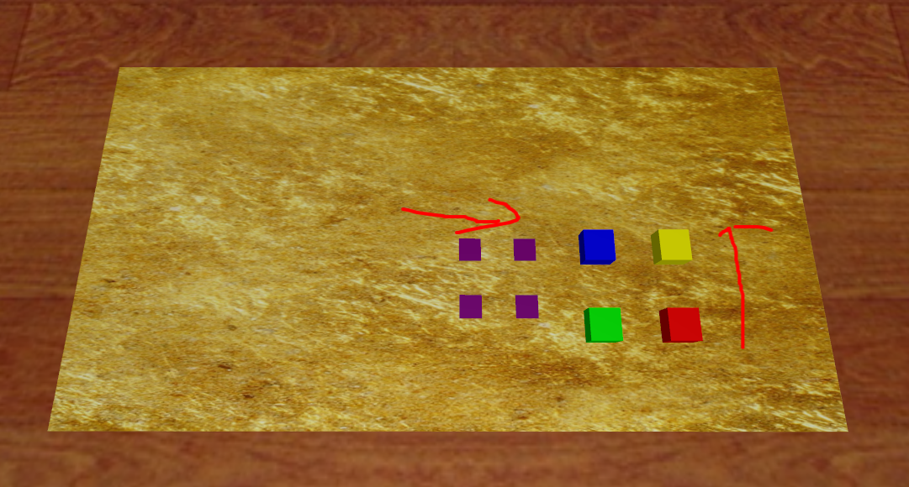

# Cap SimBoxCoverMarker Data

## 获取数据
    python record_sim_episodes.py --task_name sim_green_box_cover_bottom_left_marker --onscreen_render
Among them, `--task_name` can be changed to following parameters for producing specific episodes:

Any of the 16 in `constants.py`

## Scenario Snapshot

