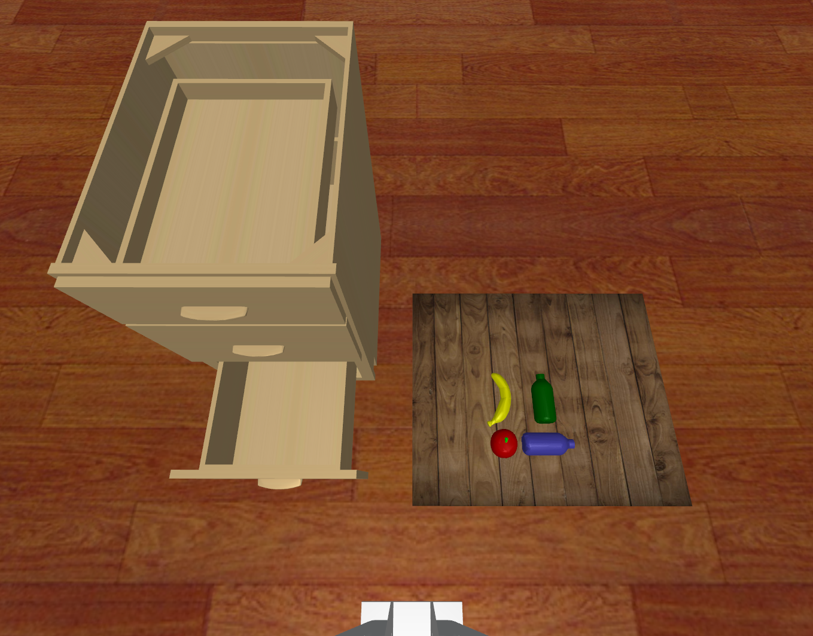

# Cap PutStuff2Drawer Data

## Commands
    python record_sim_episodes.py --task_name sim_put_apple_to_middle_drawer --onscreen_render
Among them, `--task_name` can be changed to following parameters for producing specific episodes:
`--task_name sim_put_apple_to_middle_drawer
`
`--task_name sim_put_blue_bottle_to_bottom_drawer
`
`--task_name sim_put_banana_to_bottom_drawer
`
`--task_name sim_put_green_bottle_to_bottom_drawer
`

## Scenario Snapshot

