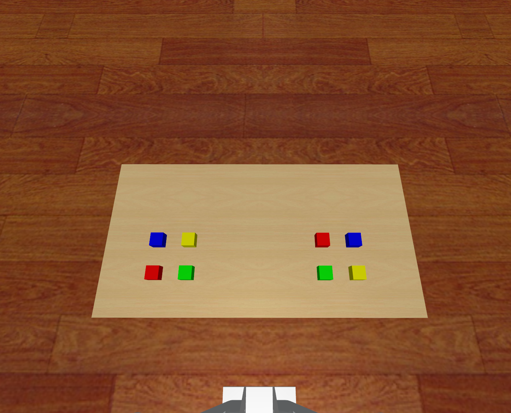

# Cap SimCubeTransfer Data

## 获取数据
    python record_sim_episodes.py --task_name sim_transfer_left_green_block_to_right --onscreen_render
Among them, `--task_name` can be changed to following parameters for producing specific episodes:

Any of the 8 in `constants.py`

## Scenario Snapshot

