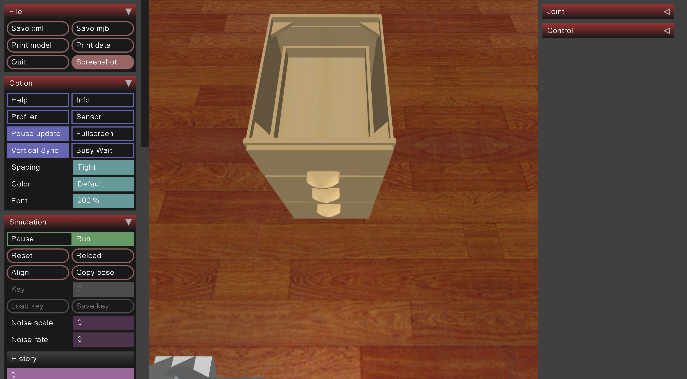

# Cap OpenCabinet Data

## Command
    python record_sim_episodes.py --task_name sim_open_cabinet_top_drawer --num_episodes 50 --onscreen_render
Among them, `--task_name` can be changed to following parameters for producing specific episodes:
`--task_name sim_open_cabinet_top_drawer
`
`--task_name sim_open_cabinet_middle_drawer
`
`--task_name sim_open_cabinet_bottom_drawer
`

## Scenario Snapshot

