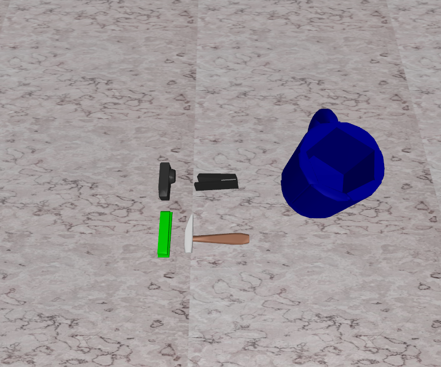

# Cap PutStuff2Basket Data

## Command
    python record_sim_episodes.py --task_name sim_put_hammer_to_basket --num_episodes 50 --onscreen_render
Among them, `--task_name` can be changed to following parameters for producing specific episodes:
`--task_name sim_put_hammer_to_basket
`
`--task_name sim_put_camera_to_basket
`
`--task_name sim_put_green_stapler_to_basket
`
`--task_name sim_put_black_stapler_to_basket
`

## Scenario Snapshot

