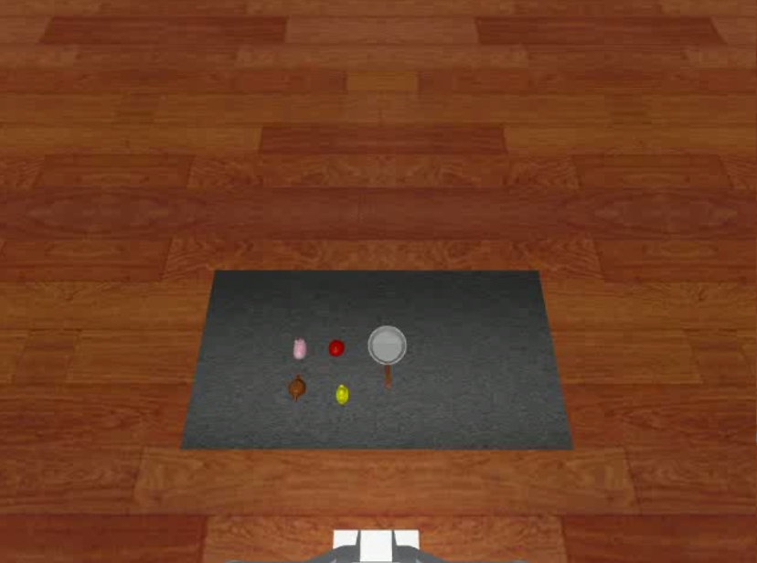

# Cap PutStuff2Pan Data

## Command
    python record_sim_episodes.py --task_name sim_put_duck_to_pan --num_episodes 50 --onscreen_render
Among them, `--task_name` can be changed to following parameters for producing specific episodes:
`--task_name sim_put_apple_to_pan
`
`--task_name sim_put_duck_to_pan
`
`--task_name sim_put_pig_to_pan
`
`--task_name sim_put_teapot_to_pan
`

## Scenario Snapshot

