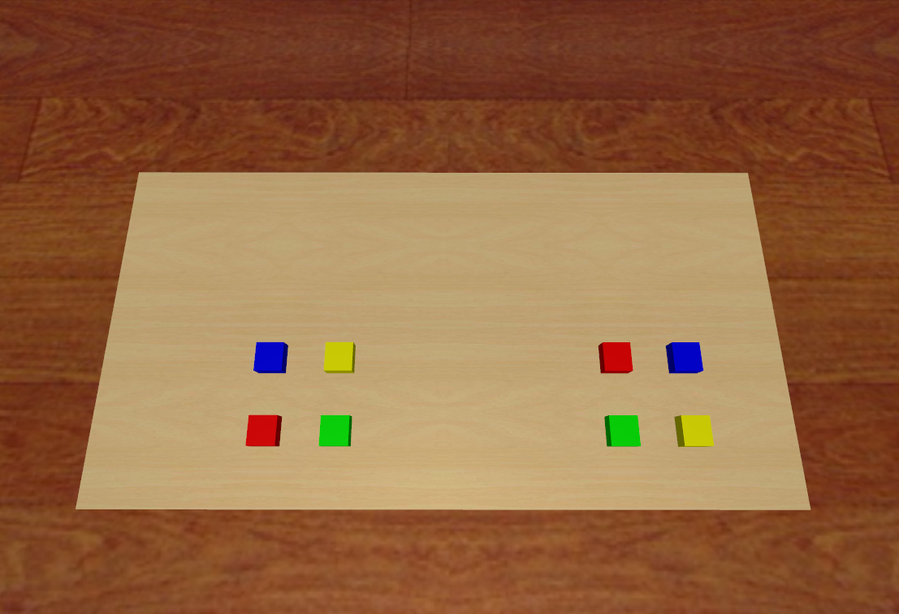

# Cap SimPickColoredBlocks Data

## Commands
    python record_sim_episodes.py --task_name sim_pick_the_left_red_block --onscreen_render
Among them, `--task_name` can be changed to following parameters for producing specific episodes:
`--task_name sim_pick_the_right_red_block
`
`--task_name sim_pick_the_right_yellow_block
`
`--task_name sim_pick_the_right_blue_block
`
`--task_name sim_pick_the_right_green_block
`
`--task_name sim_pick_the_left_red_block
`
`--task_name sim_pick_the_left_yellow_boxblock
`
`--task_name sim_pick_the_left_blue_block
`
`--task_name sim_pick_the_left_green_block
`

## Scenario Snapshot
